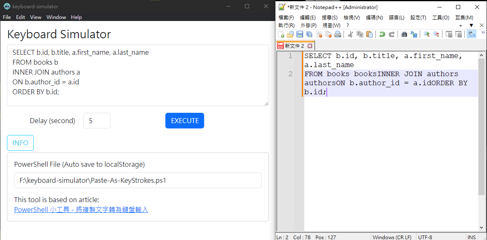

# Keyboard Simulator

## 需求說明

基於PowerShell鍵盤輸入工具，用於特定環境無法複製貼上，提供操作介面供模擬輸入

## 使用說明

1. Powershell 執行檔位置: 於INFO按鈕下，填入PS執行檔絕對路徑，此欄位自動儲存於LocalStorage中

2. 設定延遲秒數：選擇延遲啟動秒數（預設：5秒）

3. 填入要複製貼上的文字，點選EXECUTE

4. 啟動後移至待輸入區域

## 參考資料

[PowerShell 小工具 - 將複製文字轉為鍵盤輸入](https://blog.darkthread.net/blog/ps-paste-as-keystrokes/)

## Discussion?

- GitHub Actions: Auto build and release?

- Better way to run powershell script: Node.js build-in method is not well for multiple line script

- Ligher framework: Electron way too heavy for this small function

- Backend server log: console log only in dev environment. Still need log after built.